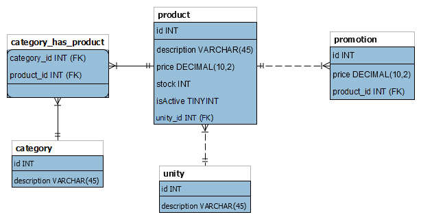

# AppStore

### Funcionalidades

- [ ] Integração com banco de dados MySql
- [ ] Controle de Transação

### Crud (Controllers)

##### Category

- [x] Obter todos
- [x] Obter um
- [x] Criar
- [x] Atualizar
- [x] Deletar

##### Promotion

- [ ] Obter todos
- [ ] Obter um
- [ ] Criar
- [ ] Atualizar
- [ ] Deletar

##### Unity

- [x] Obter todos (Memória)
- [x] Obter um
- [x] Criar [ ] (Banco de dados)
- [x] Atualizar
- [x] Deletar

##### Product

- [x] Obter todos
- [ ] Obter um
- [x] Criar
- [ ] Atualizar
- [ ] Deletar

### Modelo Entidade Relacionamento

